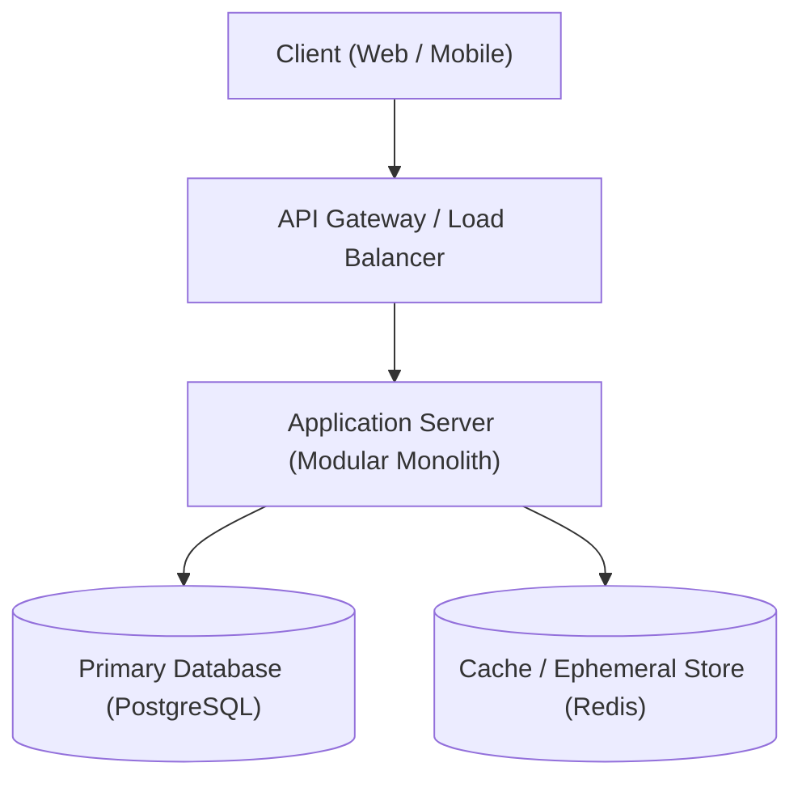
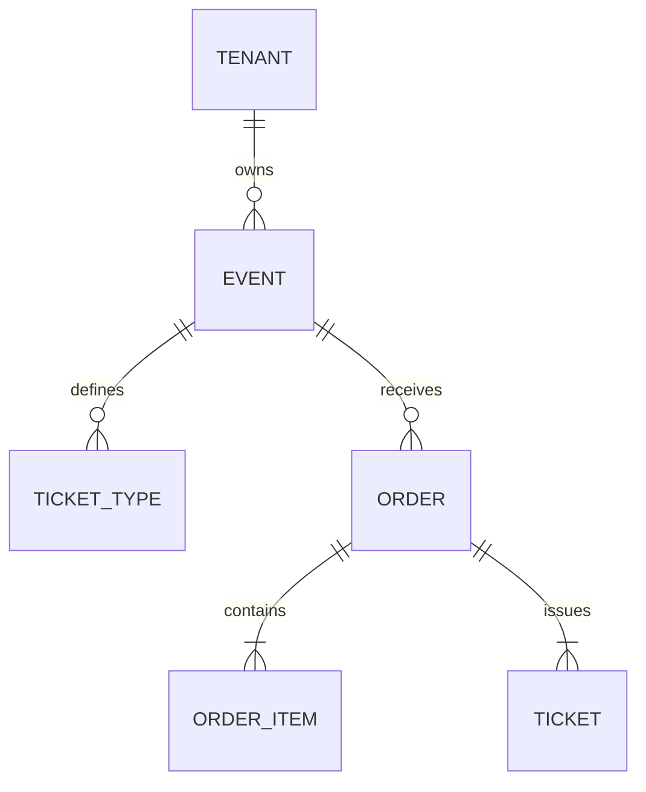
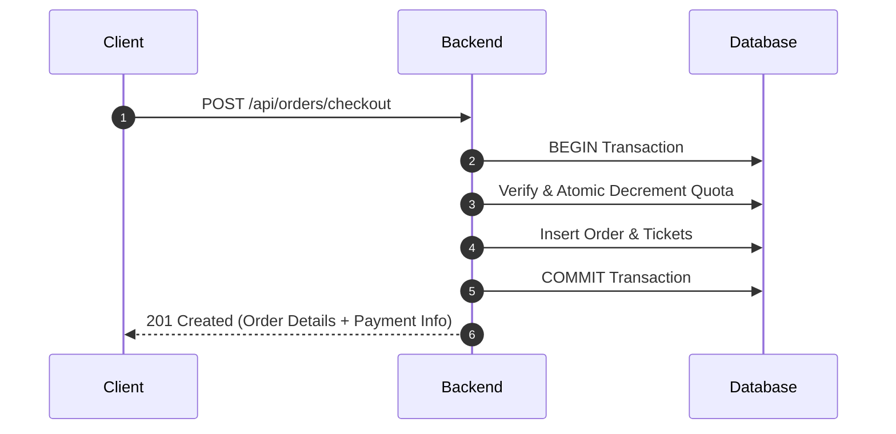

# System Design & Software Architecture (Project-Agnostic)

A principal-grade architecture skill for designing software systems, data models, domain boundaries, and migration strategies across any domain, language, or scale.

```text
resources/
├── architectural-decision-records.md    Structured ADR templates, context-driven trade-off evaluations
├── data-modeling-and-persistence.md     Relational, Document, Graph, KV modeling, indexing, consistency models
├── scalability-and-distributed-patterns.md  Caching topologies, async workers, load balancing, failure modes & resilience
└── phased-migration-rewrite.md          Strangler fig pattern, blast radius analysis, zero-downtime data migrations
```

---

## 1. Purpose

To architect clean, resilient, cost-effective, and scalable software systems from first principles. This skill evaluates business constraints, throughput requirements, data consistency needs, and failure domains to produce actionable **System Design Documents**, **Data Models (ERDs)**, and **Architecture Decision Records (ADRs)** without speculative complexity.

---

## 2. Scope

### In Scope
- **High-Level & Low-Level Architecture:** Monolith vs Modular Monolith vs Distributed Services, service boundaries, component decoupling.
- **Domain Modeling & Data Persistence:** Entity Relationship Diagrams (ERDs), relational normalization vs denormalization, primary key strategies (UUIDv7, NanoID, Auto-inc), database selection (SQL, NoSQL, Time-series, Key-Value).
- **Communication & Protocols:** Synchronous REST / GraphQL / gRPC vs Asynchronous Message Queues (Kafka, RabbitMQ, SQS, Redis Streams) vs WebSockets / Server-Sent Events.
- **Concurrency, Consistency & Transactions:** ACID guarantees, 2-phase commits, Saga patterns, Eventual Consistency, Distributed Locks.
- **Caching & Performance Topologies:** Read-through, Write-through, Cache-aside, Invalidation strategies, CDN edge caching.
- **Resilience & Reliability:** Circuit breakers, rate limiters, bulkhead isolation, dead-letter queues, graceful degradation.
- **Migration & Evolution:** Strangler Fig refactoring, dual-write migrations, backward compatibility.

### Out of Scope
- Pixel-level CSS styling and component layout tweaking $\to$ delegate to `frontend`.
- Writing routine CRUD handlers or boilerplate ORM queries $\to$ delegate to `backend`.
- Authoring automated QA test scripts and test suites $\to$ delegate to `qa-testing`.
- Active penetration testing and offensive exploit verification $\to$ delegate to `pentest`.

---

## 3. When to Use

- Designing a new software product, platform, or subsystem from the ground up.
- Evaluating database and technology stack selection (e.g. "PostgreSQL vs MongoDB", "REST vs gRPC").
- Planning high-concurrency architecture (e.g. Flash sales, ticketing bursts, real-time tracking).
- Architecting data models, entity relationships, and state machine lifecycles.
- Restructuring a legacy codebase or planning a zero-downtime system migration / rewrite.
- Authoring formal Architecture Decision Records (ADRs) to document key trade-offs.

---

## 4. When NOT to Use

- If the task is fixing a specific UI bug or building a single frontend page $\to$ use `frontend`.
- If the task is writing standard backend endpoints with established patterns $\to$ use `backend`.
- If the task is running security vulnerability audits on source code $\to$ use `security`.
- If the task is executing adversarial penetration probes $\to$ use `pentest`.

---

## 5. Initial Discovery (Phase 1: Zero Assumptions)

Before proposing any system architecture, discover the existing context:

1. **Inspect Current Repository Architecture:**
   - Single repository, monorepo, or multi-repo?
   - What runtime, frameworks, and storage drivers are currently in place?
   - What existing database schemas, migrations, or data pipelines exist?
2. **Identify Operational Constraints & Host Environment:**
   - Cloud provider (AWS, GCP, Azure), bare-metal, VPS, serverless, or local Docker?
   - Team size and maintenance capacity (Can a 2-person team operate a 15-microservice Kubernetes cluster? No).
3. **Analyze Domain Entities:**
   - What are the core business invariants, immutable legal records, and high-frequency read/write paths?

---

## 6. Context Understanding (Phase 2: Scale, SLOs & Criticality)

Quantify the operational reality before designing:
- **Traffic & Throughput:** Read QPS, Write QPS, Peak Burst multiplier (e.g. 10x normal during launches).
- **Data Volume & Growth:** Initial dataset size, daily write volume, retention period (e.g. 1GB/month vs 10TB/day).
- **Latency & Availability Targets:** Target p99 response time (e.g. <100ms), uptime SLA (99.9% vs 99.99%).
- **Consistency Requirements:** Strict immediate consistency (financial balances, seat reservation) vs Eventual consistency (analytics, feed updates, view counters).

---

## 7. Analysis & Design Methodology

Follow the disciplined **Reasoning Chain**:

$$\text{Requirements \& Scale} \longrightarrow \text{Domain Modeling} \longrightarrow \text{Topology Selection} \longrightarrow \text{Failure Mode Analysis} \longrightarrow \text{Trade-off Evaluation (ADR)}$$

### The 10 Inquiries for Every Architectural Decision
1. **What is the functional goal?** (What business capability must the system provide?).
2. **What are the non-functional constraints?** (Throughput, latency, consistency, budget).
3. **What is the simplest architecture that fulfills the requirement?** (Single SQLite/PostgreSQL instance vs distributed cluster).
4. **Where are the state boundaries?** (Which entities must live in the same transactional boundary?).
5. **What are the single points of failure (SPOFs)?** (Database node, external payment gateway, cache).
6. **How does the system degrade under overload?** (Backpressure, rate limiting, queuing, read-only fallback).
7. **What is the cost of operation?** (Infrastructure cost + developer cognitive overhead).
8. **What are the concrete trade-offs?** (e.g., Higher write throughput at the cost of eventual consistency).
9. **How is the system monitored and debugged?** (Distributed tracing, structured logging, health probes).
10. **Can this design be phased incrementally?** (Can we build the simplest version first and scale as demand materializes?).

---

## 8. Architecture Artifacts

Every System Design output must provide:
1. **C4 Component / Container Diagram (Mermaid):** Visualizing client, gateway, services, and persistence boundaries.
2. **Data Model / ERD:** Entity tables/collections, explicit foreign keys, primary key formats, indexes, and cardinality.
3. **Sequence Diagram:** Tracing critical mutations from user request to persistence commit.
4. **Architecture Decision Record (ADR):** Context $\to$ Decision $\to$ Status $\to$ Consequences / Trade-offs.

---

## 9. Critical Reasoning Rules & False-Positive Filters

- **Monolith $\neq$ Outdated:** A well-structured Modular Monolith is the optimal architecture for >95% of software systems. Do NOT recommend microservices without evidence of distinct independent scaling bottlenecks or large multi-team organizational boundaries.
- **Relational SQL $\neq$ Unscalable:** Modern relational databases (PostgreSQL, MySQL) effortlessly handle tens of thousands of QPS with proper indexing and connection pooling. Do NOT prematurely jump to NoSQL or Sharding without proven read/write exhaustion.
- **Asynchronous Queues $\neq$ Free Performance:** Introducing message brokers (Kafka/RabbitMQ) adds operational complexity, dual-write consistency challenges, and message ordering hurdles. Use synchronous transactions when operations complete in <100ms.
- **Caching is a Trade-off, Not a Silver Bullet:** Adding Redis introduces cache invalidation, cache stampede, and stale data risks. First optimize database indexes and query structure before adding caching layers.

---

## 10. Anti-Overengineering Guardrails (Ponytail Principles)

1. **Start with the Minimum Cohesive Architecture:**
   - Single relational database + Modular monolithic backend + Stateless application servers.
   - Scale vertically first before distributing horizontally.
2. **No Speculative Abstractions:**
   - Do not design multi-cloud abstraction layers or dynamic plugin systems unless explicitly required by business contracts.
3. **Formula for Architectural Recommendations:**
   $$\text{Bottleneck / Requirement} \longrightarrow \text{Evidence} \longrightarrow \text{Proposed Architecture} \longrightarrow \text{Benefit} \longrightarrow \text{Operational Trade-off}$$
   *If the current architecture comfortably handles load with low complexity: PRESERVE IT.*

---

## 11. Architecture Decision Classification

| Category | Definition | Example |
|---|---|---|
| **CORE ARCHITECTURE** | Fundamental topology and data boundary decisions | Adopting PostgreSQL with modular domain modules; Using relational schema with UUIDv7 PKs |
| **PERSISTENCE STRATEGY** | Storage engine, indexing, and transactional boundaries | Relational tables for immutable ledgers; In-memory Redis for ephemeral session tokens |
| **COMMUNICATION PROTOCOL** | Network boundary and integration contract | Synchronous HTTP REST for CRUD; WebSockets for real-time seat map locks |
| **RESILIENCE PATTERN** | Fault tolerance and overload mitigation | Atomic SQL decrement for quota reservation; Exponential backoff with DLQ for webhooks |
| **EVOLUTION / PHASE** | Phased migration steps to transition from old to new | Dual-write phase $\to$ Backfill $\to$ Read switch $\to$ Deprecate legacy table |

---

## 12. Output Format: System Design Document (SDD)

```markdown
# System Design Document: [System / Platform Name]

## 1. System Overview & Problem Statement
- **Business Goal:** [Clear summary of what the system achieves]
- **Key Constraints:** [Scale, latency SLOs, consistency requirements, budget]

## 2. High-Level Architecture (C4 Model)


## 3. Domain Model & Data Architecture (ERD)

- **Primary Key Strategy:** [e.g. UUIDv7 / NanoID]
- **Key Indexes & Partitioning:** [e.g. `(tenant_id, created_at)` for ledger queries]

## 4. Critical User Flows & Sequence


## 5. Resilience, Failure Modes & Edge Cases
- **Failure Scenario 1 (Payment Webhook Timeout):** [Idempotent handler with order status verification]
- **Failure Scenario 2 (Flash Concurrency Burst):** [Row-level atomic update with WHERE quota >= requested]

## 6. Architecture Decision Record (ADR)
- **Decision:** [e.g. Adopt Modular Monolith over Microservices]
- **Context:** [Single development team, shared transaction boundaries for tickets and settlements]
- **Trade-offs Accepted:** [Services share process memory; mitigated by strict module boundaries]
```

---

## 13. Verification & Self-Review

Before concluding any system design:
- [ ] Requirements are quantified (throughput, data volume, latency SLOs).
- [ ] Data models have explicit foreign keys, indexes, and transactional boundaries.
- [ ] Single points of failure and edge cases (network timeouts, concurrent bursts) are analyzed.
- [ ] No premature microservices, unneeded message queues, or speculative layers introduced.
- [ ] The design is explainable, maintainable, and phased incrementally.
